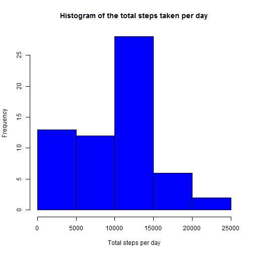
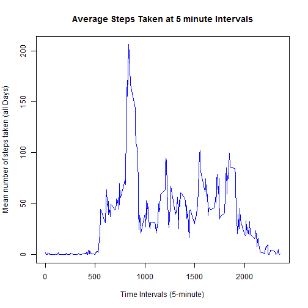
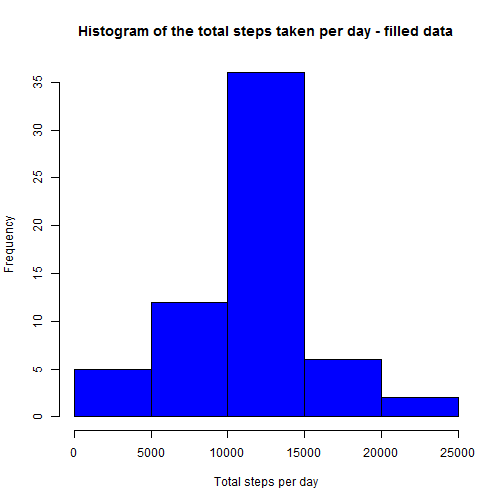
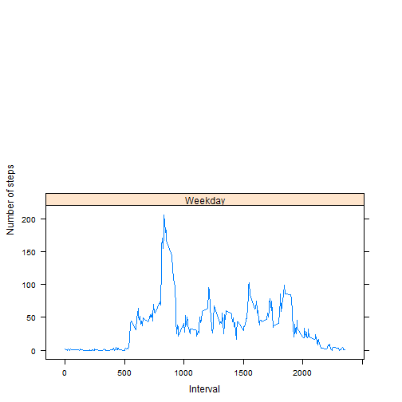

#Reproducible Research: Peer Assessment 1
Date: 2015-05-17


## Loading and preprocessing the data
We have a activity.csv in the working directory, following R code will load it as a dataset and convert dates into R date format.


```r
library(lattice)
aData <- read.csv("activity.csv")
aData$date <- as.Date(aData$date,"%Y-%m-%d")
```


## What is mean total number of steps taken per day?
1. Compute total number of steps per day  

```r
totsteps <- tapply(aData$steps, aData$date,sum, na.rm = TRUE)
```

2. Make a histogram of **the total number of steps taken each day**

```r
hist(totsteps,col="blue",xlab="Total steps per day", 
      ylab="Frequency", main="Histogram of the total steps taken per day")
```

 

3. Compute mean and median of the total steps taken per day

```r
mean(totsteps,na.rm=TRUE)
```

```
## [1] 9354.23
```

```r
median(totsteps,na.rm=TRUE)
```

```
## [1] 10395
```
  

## What is the average daily activity pattern?
1. Make a time series plot of the 5-minute interval (x-axis) and the average number of steps taken, averaged across all days (y-axis)

```r
meanSteps <- tapply(aData$steps,aData$interval,
                                 mean,na.rm=TRUE)

plot(row.names(meanSteps),meanSteps,type="l",
     xlab="Time Intervals (5-minute)", 
     ylab="Mean number of steps taken (all Days)", 
     main="Average Steps Taken at 5 minute Intervals",
     col="blue")
```

 

2. Which 5-minute interval, on average across all the days in the dataset, contains the maximum number of steps?

```r
intervalNumber <- which.max(meanSteps)
intervalNumber
```

```
## 835 
## 104
```

```r
intervalMax <- names(intervalNumber)
intervalMax
```

```
## [1] "835"
```
The 835 minute that is the 104th 5-minute interval contains the maximum number of steps on average across all the days.


## Imputing missing values
1. Calculate and report the total number of missing values in the dataset.

```r
numNA <- sum(is.na(aData))
numNA
```

```
## [1] 2304
```

2. Fill all of the missing values with mean value for that 5-minute interval.

```r
averages <- aggregate(x = list(steps = aData$steps), by = list(interval = aData$interval), 
    FUN = mean, na.rm = TRUE)

fill.value <- function(steps, interval) {
    filled <- NA
    if (!is.na(steps)) 
        filled <- c(steps) else filled <- (averages[averages$interval == interval, "steps"])
    return(filled)
}
filledData <- aData
filledData$steps <- mapply(fill.value, filledData$steps, filledData$interval)
```

3. Make a histogram with the new dataset


```r
totsteps2 <- tapply(filledData$steps, filledData$date,sum, na.rm = TRUE)
hist(totsteps2,col="blue",xlab="Total steps per day", 
      ylab="Frequency", main="Histogram of the total steps taken per day - filled data")
```

 

4. Calculate new mean and median

```r
mean(totsteps2)
```

```
## [1] 10766.19
```

```r
median(totsteps2)
```

```
## [1] 10766.19
```

Mean and median values are now higher which is caused by replacing the NAs.

## Are there differences in activity patterns between weekdays and weekends?
1. Create a new factor variable in the dataset with two levels – “weekday” and “weekend” indicating whether a given date is a weekday or weekend day.


```r
days <- weekdays(filledData$date)
filledData$day_type <- ifelse(days == "Saturday" | days == "Sunday", 
                                "Weekend", "Weekday")
meanSteps <- aggregate(filledData$steps,
                                    by=list(filledData$interval,
                                            filledData$day_type),mean)
names(meanSteps) <- c("interval","day_type","steps")
```
**Plesae note that the function above uses English names of the days. Please make sure that your regional settings is set to English.**

2. Make a panel plot containing a time series plot (i.e. type = "l") of the 5-minute interval (x-axis) and the average number of steps taken, averaged across all weekday days or weekend days (y-axis).


```r
xyplot(steps~interval | day_type, meanSteps,type="l",
       layout=c(1,2),xlab="Interval",ylab = "Number of steps")
```

 
